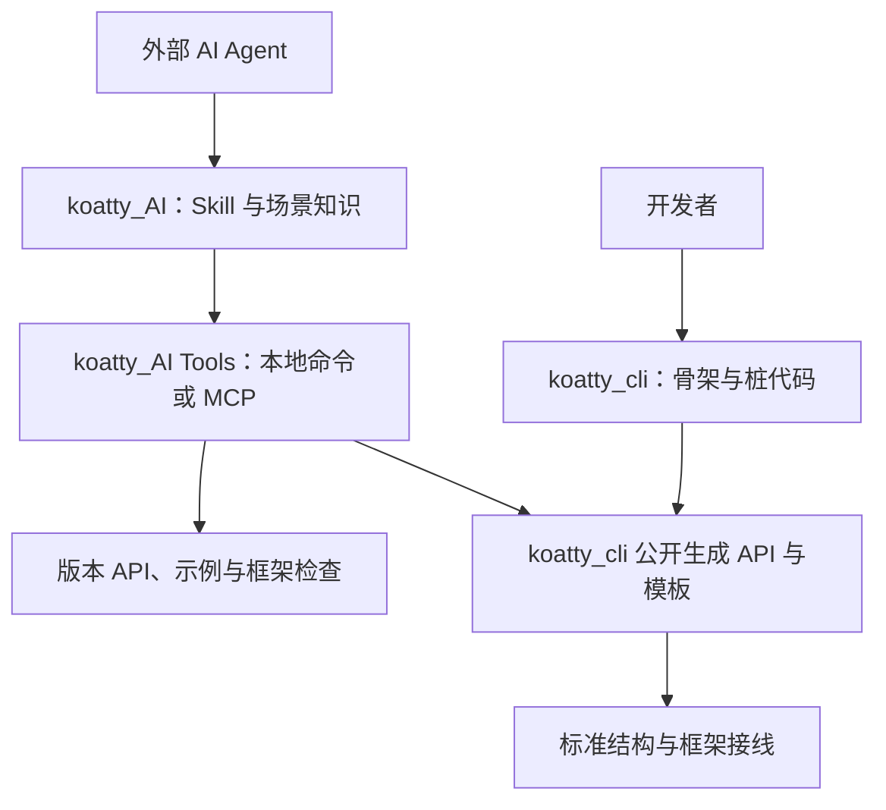

# koatty_cli 与 koatty_AI 双工具设计及现状审计

日期：2026-10-01，更新：2026-10-07。状态：S0–S4 已实施并推送（npm 未发布）；S5 外部 Agent 实测待执行。实施记录见第 12 节与 docs/migration/koatty-cli-agent-split.md。

## 1. 定位与范围修正

**koatty_ai 是供外部 AI Agent 使用的 Koatty Skill + Tools：把框架知识、标准实现和框架校验交给工具，帮助 Agent 更快、更准确地开发 Koatty 应用。**

核心目标是降低框架使用偏差：错误 import、不存在的装饰器、错误参数顺序、组件加载失败、DI 作用域错误、协议配置缺失，以及复制旧版本示例。业务需求理解、任务规划、业务算法、文件编辑与修复循环由外部 Agent 承担。

用户确定发布两个独立工具：koatty_cli 面向开发者，koatty_AI 面向外部 Agent。koatty_AI 的命令入口只是 Tools 的本地执行适配器，MCP 是另一种可选适配器。Skill 是 AI 产品的主要使用指南，具有独立的场景导航、决策规则和参考资料。

上一版过度强调通用开发流程，现明确收敛：

| 上一版设计 | 本次处理 |
|---|---|
| DeliveryContract、需求编号到测试的通用交付系统 | 移出范围；需求与验收由宿主 Agent 管理 |
| operation 状态机、任务持久化、status/recover 工具产品化 | 移出范围；保留既有文件写入保护与失败诊断 |
| 通用文件 read、任意代码 changeset 作为核心入口 | 不新增；复用宿主读写工具，已有 changeset 兼容入口保留 |
| context 与知识检索 | 收敛为 Koatty 项目结构、版本 API 与框架场景知识 |
| recipe、结构生成、框架检查 | 提升为核心工具能力 |
| 框架验证、真实协议测试 | 保留；输出检查事实，不接管业务任务完成判定 |

不接入 LLM、不增加聊天入口、不做自主任务循环、不管理模型预算、不实现通用代码编辑器。既有 `agent` 工程模板可以保留，它生成使用模型的业务应用，与 CLI 自身接入模型是两回事。

### 两个产品与发布边界

| 维度 | koatty_cli | koatty_AI |
|---|---|---|
| 使用者 | 人类开发者 | 外部 AI Agent |
| 产品职责 | 传统脚手架、项目骨架、组件/桩代码、字段驱动 CRUD | Koatty Skill + 框架知识工具、场景生成、用法检查 |
| npm 包标识（设计） | 保留 `koatty_cli` | 建议使用小写 `koatty_ai`，展示名使用 `koatty_AI`；发布前核实名称可用性与发布权限 |
| 可执行入口 | 保留 `koatty` / `kt` | 新增独立 `koatty-ai`，不争用旧 bin |
| 主要交互 | 人类帮助、交互向导、显式参数 | Skill 引导、结构化参数/结果、非交互 Tools、可选 MCP |
| 分发内容 | 生成器、传统模板、CLI 文档 | Skill、版本知识、测试过的示例、recipes、检查规则、Tools |
| 依赖边界 | 不依赖 koatty_ai，不因新 AI 能力增加 MCP/知识检索运行依赖 | 通过正式 dependencies 依赖 koatty_cli 的生成 API，由包管理器安装；不依赖 LLM SDK |
| 发布与升级 | 保留历史版本链与兼容策略 | 新包独立版本、CHANGELOG、文档及验收 |

两个工具由两个独立 Git submodule 维护，具有独立仓库和发布产物。koatty_cli 可单独使用；安装 koatty_ai 会自动安装其依赖的 koatty_cli，无需用户提前手动安装或调用传统 CLI。同步推出不等于版本号必须相同，更不意味着 npm 多包发布具备原子性。两者分别形成可安装产物，不能只在同一个 CLI 上增加一个 AI 模式。

当前 `packages/koatty-ai/package.json` 实际发布名是 `koatty_cli`；目前并没有两个独立产物。实现时必须拆分包清单与构建产物，不能仅将这个 package.json 改名，否则会丢失传统 CLI 的发布延续。

## 2. 现状审计：已有基础与真正缺口

下表源码路径相对 `packages/koatty-ai/`。依据当前源码及上一轮已执行基线，不把历史 Phase G 缺口当作仍未实现。

| 现状与证据 | 对新定位的意义 | 处理方向 |
|---|---|---|
| `skills/koatty/SKILL.md` 已有版本发现、框架不变量、四份参考指南；`scaffold.ts` 会随工程分发 | 已有 Skill 基础，无需另造一套 | 将入口改为常见开发场景导航，明确何时调用生成器、何时查 API、何时直接编辑 |
| `framework.md` 已说明 DTO/import/DI/生命周期，但知识偏概括 | Agent 仍要自行拼接跨文件实现 | 增加与框架版本匹配、经过编译及行为测试的完整示例 |
| `capabilities` 只公开少数操作 schema；单文件命令缺统一 root/json 参数 | Agent 自动化调用成本高 | 公布生成能力的输入、支持组合、产物和失败语义 |
| `GeneratorPipeline` 和 `ModuleGenerator` 以 CRUD 为核心；Validator 要求字段；固定生成 Model/DTO/Service/Controller/Test | 不适合无数据库业务服务或给现有组件增加动作 | 引入小型场景 recipe，复用现有生成器，按需要生成和复用组件 |
| controller 模板固定 CRUD，未使用自定义 endpoints；service 模板硬编码数字 id | 声明和输出不一致会引导 Agent 写错业务 | 首先修复支持矩阵；不支持参数明确拒绝，不静默忽略 |
| `AuthAspect.hbs` 留有必须实现的 token 校验；测试主要覆盖分页 mock 和方法存在 | 骨架不等于可用认证或完整业务 | 输出待实现项，认证接入优先引用现有服务，增加真实接线与拒绝路径测试 |
| manifest、explain、docs、doctor 已有框架发现能力 | 可以组合成按任务聚焦的上下文 | 返回相关组件、API、示例、版本与 unresolved，避免重建通用文件检索 |
| plan/apply 已共用前像、签名、会话边界和写入事务 | 适合保护生成器输出 | 继续使用；plan 扩展接收框架 recipe，不发展成通用任务规划器 |
| verify 已有 types/test/lint/manifest | 可作为生成后的检查底座 | 增加 Koatty 专用规则与定位；不声称静态检查证明业务正确 |
| README 有默认 apply 行为、模板版本、缓存优先级等相互矛盾的说明 | Agent 可能学到错误行为 | 文档、Skill、工具 schema 和示例建立一致性测试 |

现有开发 MCP 有 10 个工具。CLI/MCP 已有共享操作层和 v1 结果契约；本设计继续复用，不重写已经成立的基础。

### 已执行的源码基线（上一轮）

上一轮执行 CLI 已有构建产物 `--help`，核对入口；并直接检查命令注册源码，避免把旧 dist 当作唯一依据。源码基线如下，测试全部通过也不代表缺失业务能力已经实现。

| 实际执行 | 结果 |
|---|---|
| `pnpm --filter koatty_cli exec jest --runInBand --coverage=false` | 43/43 suites、215/215 tests 通过，退出码 0 |
| `pnpm --filter koatty_cli exec tsc --noEmit` | 退出码 0 |
| 主仓库与 koatty-ai 子模块工作区检查 | 上一轮开始时干净；本次继续修订本文，子模块未修改 |

没有执行真实 LLM、外部 Agent 客户端、生产数据库、独立 npm 安装或发布验收。本轮不需要模型凭据。

## 3. 架构：知识引导、标准生成、框架校验



三部分形成互补：Skill 影响 Agent 的决策，生成器直接消除可确定的代码偏差，检查器在 Agent 编辑后发现偏差。只写一篇更长的提示词不足以保证正确性；只扩充模板也不能帮助 Agent 选择正确做法。

## 4. Skill 设计：按任务加载知识

### 4.1 入口保持简短

SKILL.md 包含触发范围、首轮项目识别、场景索引、必须遵守的框架规则和最短工具路径。完整 API/模板说明留在 references，按需加载，避免每次读完整框架手册。

建议结构（待实施，优先重组现有资料而非复制）：

```text
skills/koatty/
  SKILL.md
  references/
    project.md           项目识别、目录、版本、启动和手动创建
    http-dto.md          HTTP 参数、DTO、验证与返回值
    service-di.md        Service、注入、作用域与生命周期
    persistence.md       实体、仓储、事务与迁移边界
    protocols.md         gRPC / WebSocket / GraphQL / SSE
    extensions.md        middleware / plugin / aspect / config
    mcp-agent.md         业务 MCP 与 LLM 应用，按需使用
    testing.md           框架测试启动、清理、协议验证
    troubleshooting.md   错误到原因、规则、示例的映射
```

可执行示例放在包内单一维护位置；Skill 引用它们，不再维护一份可能漂移的代码副本。具体目录与现有 templates、recipes、tests 协调，不为目录整齐重复实现。

### 4.2 场景路由

| Agent 当前任务 | Skill 指导 | 首选能力 |
|---|---|---|
| 新建项目 | 识别应用类型与框架版本，选择最小依赖 | 项目生成器 |
| 新增 HTTP 接口 | 查询既有 Service/DTO，选现有组件或生成新组件 | 项目上下文 + HTTP action recipe |
| 新增 CRUD | 核对数据库、主键、字段和已有认证 | CRUD recipe |
| 修改已有业务 | 读取已有实现，按当前 API 修改方法，保留框架结构 | 宿主编辑器 + 框架检查 |
| 接入可选组件 | 核对已安装版本、依赖及初始化生命周期 | API/示例查询 + 对应 recipe |
| 编译或运行出错 | 按诊断定位，不猜装饰器、不关闭验证掩盖问题 | doctor/check/verify + troubleshooting |

Skill 不要求每次机械执行全部工具。纯 Service 方法修改可只查相关 API、检查受影响文件并运行测试；新工程才需要项目生成流程。

### 4.3 关键行为规则

- 新建框架结构优先使用受支持 recipe；已有组件优先复用，不能重复创建第二个同名服务或认证切面。
- 框架 API 不确定时先查询当前版本声明和示例，不从相似框架类推装饰器与生命周期。
- 生成后只补业务实现所需代码；修改生成的框架接线时执行相应检查，不将生成文件视为永不可编辑。
- DTO 运行时校验、参数顺序、类名/文件名、容器作用域和启动方式遵守当前项目契约。
- 缺少 recipe 时使用已验证示例与宿主编辑器；不为了调用工具把业务扭曲成 CRUD。
- 写入前遵守宿主权限和既有计划机制；用户代码有冲突就报告，不覆盖以求生成成功。
- 验证失败根据具体诊断修复；检查未覆盖或静态无法解析时明确说明。

Skill 指令是引导，不能强制所有宿主 Agent 遵守。因此最易出错、可确定的约束必须同时落实到生成器和检查器。

## 5. Tools 设计：少量、框架专用、输入明确

以下为目标接口；新增名称和参数尚未实现，调用前必须以 capabilities 为准。

| 能力 | 复用/扩展方向 | 返回给 Agent 的价值 |
|---|---|---|
| capabilities / doctor | 复用现有 | 工具支持范围、依赖与版本诊断 |
| context | 聚合 manifest、routes、explain 的框架信息 | 相关组件、目录、DI、DTO、协议及静态不确定项 |
| docs | 扩展已有 koatty_docs，并提供 CLI 对等入口 | 版本匹配的 API 签名、import 来源、完整示例、禁用写法 |
| recipes | 新增可发现目录与输入 schema | 当前能可靠生成什么、需要哪些参数、哪些组合不支持 |
| plan / apply | 保留现有，plan 增加 recipe 输入 | 标准框架代码和明确 diff；已有冲突、过期、前像保护 |
| check | 新增 Koatty 静态规则 | 文件/行号、规则 ID、原因、修复建议、正确示例引用 |
| verify | 复用类型/测试/lint/manifest | 已执行检查及结果，不自动宣告业务需求完成 |

不增加通用 shell、任意文件编辑、任务列表、会话恢复和模型工具。MCP 是可选接入方式，Skill 可以直接指导 Agent 调用 koatty_AI 自带的本地工具入口 `koatty-ai`，无需手动安装或调用 koatty_cli，其库依赖由包管理器解析，也不要求先搭建额外服务。

koatty_AI 的本地 Tools/MCP 共用 schema、处理函数与错误语义；保留可复用的 v1 envelope。JSON stdout 只输出机器结果，进度走 stderr；参数缺失或不支持时立即返回，自动化路径不进入交互询问。

context 优先返回路径、符号、相关框架声明与摘要，宿主已有读文件能力负责读取业务源码。输出分页/截断显式说明，配置只返回键/schema，不返回配置值。

## 6. 生成能力：减少 Agent 自行拼框架代码

### 6.1 从单文件模板扩展到小型场景 recipe

recipe 是确定性的框架组合模板，输入是结构参数，不是自然语言，也不接收任意脚本。它包括版本范围、参数 schema、依赖要求、输出路径、组件引用、待实现项和对应测试。

首批优先级：

1. 已有项目/组件/单文件生成器：机器接口一致、依赖正确、生成结果可编译。
2. HTTP action：DTO + Controller 方法 + Service 引用与注入，按需新建 Service。
3. CRUD：修复真实支持范围，主键、DTO、路由与模型一致。
4. Service、middleware、plugin、aspect 的生命周期和引用组合。
5. 按需求再扩展 gRPC、WebSocket、GraphQL、SSE 和业务 MCP 场景；不同时扩张全部。

例如“添加订单创建接口”，应允许输入 DTO 字段、HTTP 方法/路径、现有或新建 Service、方法名，由工具生成正确 import、装饰器、参数校验、注入和返回链路。Agent 补充库存、事务和业务规则，避免自行拼整个 Controller/DTO 结构。

拟议 recipe 输入示意，**不是当前可调用 schema**：

```json
{
  "recipe": "http-action",
  "controller": {"name": "OrderController", "mode": "create", "basePath": "/orders"},
  "action": {"name": "create", "method": "POST", "path": "/"},
  "input": {"dto": "CreateOrderDto", "fields": {"sku": {"type": "string", "required": true}}},
  "service": {"name": "OrderService", "mode": "reference", "method": "create"}
}
```

reference 模式必须验证服务存在且签名可兼容；不能仅按名称盲目导入。create 模式拒绝同名文件。业务方法未实现时返回明确的待完成项，不返回假成功数据。

### 6.2 对已有代码的最小、确定修改

给已有 Controller 增加动作属于有价值的框架工具能力，但应分阶段：先支持新建与引用，再支持明确的 AST 操作（添加 import、注入字段、带参数校验的路由方法）。

AST 修改只覆盖已支持语法和明确目标。遇到同名方法、重复路由、动态装饰器或无法确定的结构就报告冲突；不替换整个文件，不靠字符串大段覆盖。输出仍进入现有 ChangeSet/plan/apply。

Agent 自定义算法和业务重构继续使用宿主编辑器；不要求其提交通用 changeset JSON。

### 6.3 支持矩阵必须可信

当前模板的自定义 endpoint、非数字主键、选配 DTO、软删除和认证接入等能力要逐项建立生成测试。不支持的输入在写入前拒绝，不能接受参数后仍输出固定代码。

生成器只能保证已测试范围内的结构与接线。凭据、真实数据库初始化、业务权限策略和外部服务仍需工程配置，输出必须区分已生成和待实现。

## 7. 框架检查：把易错规则变为可执行反馈

复用 TypeScript/ts-morph 和现有 manifest；采用符号与类型解析，不仅搜索字符串。先实现少量高价值规则，每条有正例、反例、版本范围及误报测试。

| 候选规则 | 检查方式与边界 |
|---|---|
| API/import 与安装版本不符 | TypeScript 诊断结合版本知识补充建议；支持 import alias，不自行猜替代 API |
| DTO 类名/文件与 Loader 约定不一致 | 依据实际 Loader 规则与当前布局；自定义加载路径标明不确定 |
| Validated 参数类型与方法参数位置不一致 | 静态可解析时检查数量/顺序；动态数组与别名不能粗暴判错 |
| Controller 引用未发现的 Service/DTO | 类型解析与 manifest 联合诊断；动态注册标 unresolved |
| 重复路由/方法 | 按方法、路径和协议判定；动态路由不作确定结论 |
| 使用不符合项目约定的全局 IOC / 路径状态 | 检查已知调用与赋值，并给 app.container/app.paths 的版本适配建议 |
| 协议组件缺少必要配置 | 校验静态可确定的配置键/schema，无法证明运行配置时仅提示 |
| 测试误用启动方式 | 对已知 Bootstrap 导入副作用与测试初始化模式给建议，真实启动测试确认 |

Controller 中是否含业务逻辑、事务设计是否正确等语义问题不伪装成确定性 lint 错误；由 Skill 指导审查与行为测试。

诊断返回 ruleId、severity、file、line、message、suggestion、reference 和确定性说明。静态检查不通过不自动重写；只有未来经过测试的确定性 fix 才单独提供预览操作。

verify 继续运行当前项目已安装的工具，不自动安装依赖。框架行为检查通过不等于业务正确，报告只陈述实际覆盖范围。

## 8. 知识、示例和工具保持一致

建立单一维护链：框架实际导出/声明 → 版本化 API 索引与示例 → recipe 和检查规则 → Skill 引用。

- API 索引从实际包声明/导出生成；使用场景与限制由维护者编写并测试，不从类型签名臆造语义。
- 每个完整示例固定兼容范围、依赖和测试入口；跨文件示例验证 import、DI、路由和生命周期。
- recipe 输出在 CI 中编译、启动并执行代表性协议请求；非法 DTO 必须拒绝且不触达业务写入。
- Skill 和 README 的命令示例做契约回归；能力未实现或当前版本不支持时，文档不能教 Agent 直接调用。
- 版本识别优先实际安装包与声明；无法确定兼容时返回 unresolved，而不是静默套用最新模板。
- 不在每次使用时联网抓取最新文档；随包分发知识和示例，更新具有明确版本与摘要。

知识检索优先精确 API/场景 ID，再做关键词匹配；首期无需向量库、RAG 服务或模型。

## 9. 双包组织、分发与迁移

### 9.1 两个 submodule，单向复用

目标布局（待实施；本轮不移动 Git 仓库）：

```text
packages/koatty_cli/          独立 submodule；npm: koatty_cli
  src/cli/                   人类命令、交互向导；bin: koatty / kt
  src/generation/            模板渲染、结构参数、生成器
  src/changes/               ChangeSet、路径检查、计划应用
  src/api/                   无 CLI 启动副作用的公开程序接口
  templates/                 基础项目/组件/模块模板
  package.json

packages/koatty_ai/           独立 submodule；npm: koatty_ai
  skills/koatty/             Skill 与渐进式资料
  src/tools/                 框架知识、场景生成和检查
  src/cli/                   非交互 Tools 入口；bin: koatty-ai
  src/mcp/                   同一 Tools 的 MCP 适配
  recipes/                   组合规则、场景示例与测试
  package.json               dependencies: koatty_cli
```

依赖只允许 `koatty_ai → koatty_cli`。删除上一版 `tools/koatty-devkit` 私有共享包方案；底层模板和生成能力由 koatty_cli 单一维护。koatty_cli 不导入 AI 包，不反向依赖 Skill、MCP 或 AI 检查规则。

两个 submodule 各自包含 package.json、README、CHANGELOG、构建和测试配置，可以脱离 monorepo 检出、安装、构建与发布。主仓库仅组合工作区、执行集成测试并记录两个 gitlink；两仓库的远端 URL 必须按实际确认的仓库填写，不根据包名猜测或自动创建远端仓库。

### 9.1.1 程序接口，而非执行 CLI 再解析文本

koatty_cli 同时提供面向人的 bin 和面向库调用者的稳定 API。koatty_ai 在进程内调用 API，不启动 koatty/kt 子进程、不解析人类输出、不深层导入 dist 内部文件。

当前 `src/index.ts` 导向 cli，尚不能视为已具备无副作用的生成 SDK；拆分前须明确新增公开入口与 exports。拟议入口 `koatty_cli/generation`，具体函数签名在实施前用契约测试冻结：

| API 能力 | 责任与约束 |
|---|---|
| 查询生成能力 | 返回支持类型、参数 schema、生成器版本、模板来源与摘要 |
| 渲染项目/组件/模块 | 显式传入 projectRoot 与结构参数，返回 ChangeSet 和诊断；不写文件、不改 cwd、不读取 stdin |
| 准备与预览计划 | 复用前像、冲突检查和计划绑定；创建项目时独立处理目标目录尚不存在的情况 |
| 应用计划 | 复用现有路径保护与事务；错误返回给调用者，不 process.exit、不自动 commit/install |

渲染默认不联网、不打印 stdout、不启动应用。写入、持久化计划和测试执行是明确分离的操作。根目录、选项和日志回调通过参数传入；无需通过 process.env 或 process.chdir 传递上下文。

公开接口的类型与 schema 随 koatty_cli 发布，按 SemVer 管理；koatty_ai 声明已验证的兼容版本范围，并在工具 capabilities 中报告实际生成器版本。内部目录变化不应破坏调用者。

### 9.1.2 模板与场景的职责分界

基础模板、命名/import/DTO/Controller/Service 等确定性生成原语归 koatty_cli。koatty_ai 的 recipe 负责选择和组合这些原语、引用已有组件、提供框架知识与检查建议，不复制一套同名基础模板。

若 AI 场景需要新的通用生成原语，先在 koatty_cli 实现并测试，再在 koatty_ai 中组合；AI 独有的说明和示例归 AI 包。模板由 koatty_cli API 解析，不通过 ../koatty_cli/templates 等兄弟目录读取，也不要求使用者了解模板子模块布局。

现有嵌套模板 submodule 可继续由 koatty_cli 仓库管理，但发布 tarball 必须包含对应固定资源；终端用户安装 npm 包不应需要 git submodule update。koatty_ai 的分发内容不再携带基础模板副本。

### 9.1.3 当前仓库到目标仓库

当前主仓库只有 `packages/koatty-ai` 一个相关 submodule，其 package 名为 koatty_cli，且包含三个嵌套模板 submodule。因此迁移必须拆分代码和仓库归属，而非只复制两个目录或修改 npm 名称。

实施顺序：记录现有提交与模板 SHA；确认两个远端及历史保留方式；将传统 CLI/模板/生成 API 归入 koatty_cli 仓库，将 Skill/AI Tools/MCP/框架检查归入 koatty_ai 仓库；更新主仓库 .gitmodules 与两个 gitlink；同步 workspace、构建、测试、发布脚本和文档路径。

必须检查各仓库未提交改动，保留历史与资源来源。先验证子模块独立构建和打包，再验证 monorepo 集成；不能只证明在软链接工作区可运行。本轮只确定设计，尚未修改 .gitmodules、迁移目录、创建仓库或提交子模块指针。

### 9.2 两种独立使用路径

以下为目标发布后的用法；本地工具实现与发布状态见文末更新：

```sh
# 开发者使用传统工具
npm install -D koatty_cli
npx koatty new my-app
npx koatty service order

# Agent 安装 AI 工具包；包管理器自动安装其 koatty_cli 库依赖
npm install -D koatty_ai
npx koatty-ai capabilities --json
npx koatty-ai mcp
```

实际 Skill 优先调用项目本地 bin，避免 npx 在缺包时隐式下载。能力查询和 MCP 启动是替代接入方式，并非每次必须同时运行。

koatty_AI 随包分发 Skill、参考文档和示例索引。既有项目通过显式安装/更新操作接入 Skill，显示来源与版本，本地已修改的文件不覆盖。宿主特有元数据作为适配层，不假设所有宿主会自动发现项目 Skill。

koatty_cli 新建项目默认面向传统开发，不强制安装 koatty_ai 或 MCP。迁移期已有自动复制 Skill 的行为应单独标为兼容行为，目标版本通过明确选项或安装 koatty_ai 启用；变更默认值需要迁移说明。

### 9.3 兼容迁移

保留 koatty_cli 的 new/project、单文件命令、add、generate:module、SQL 转换和现有脚手架使用方式。既有 plan/apply 若供手动生成使用，也继续保留。

当前 koatty_cli 中已存在 manifest/mcp/capabilities/doctor/verify 与 Skill；它们不能因拆包在兼容版本中直接删除。先发布 koatty_ai 对等能力并更新 Skill/文档指向，再在明确的 major 迁移中移除或调整 AI 专用旧入口。过渡期可保留旧实现或提供显式安装提示，不能偷偷下载、启动新包或产生循环依赖。

迁移后新框架知识、场景工具和检查规则在 koatty_AI 演进；传统 CLI 专注骨架/桩代码体验。两个包各自有 README、CHANGELOG、安装说明、依赖清单和回归测试。

### 9.4 发布门

按仓库 RELEASE-GUIDE 和 Changesets 流程处理两个包，独立 SemVer；当前 koatty_cli 的版本历史不改写，新 koatty_ai 走新包发布流程。目标是同一轮对外提供两个工具，不宣称 registry 原子发布。

独立验证：仅安装 koatty_cli 可生成传统工程；仅安装 koatty_ai 可使用 Skill + Tools；同时安装 bin 无冲突；koatty_cli tarball 包含模板与公开 API，koatty_ai tarball 包含 Skill/Tools 并声明可解析的 koatty_cli 依赖；不能有 workspace: 或本地路径残留。两者分别运行新建项目、编译与代表性行为测试。

若 koatty_ai 依赖尚未发布的 koatty_cli 新 API，先发布并验证兼容的 koatty_cli，再发布 koatty_ai。两个 submodule 的内容先提交，再更新主仓库指针，不能只提交主仓库路径。

包名可用性、发布权限与外部 registry 状态在实际发布前核实，本设计未验证或占用名称。当前仅设计，不执行版本变更、提交、push 或 publish。

## 10. 实施顺序

| 阶段 | 交付 | 验收 |
|---|---|---|
| S0 双 submodule 拆分 | 保留 koatty_cli 包身份及生成能力；新增公开生成 API；koatty_ai 单向依赖 | 两仓库分别构建/打包；AI 单独安装可解析 CLI 依赖；公开 API 无启动副作用 |
| S1 知识与 Skill | 场景导航、版本 API/示例索引、文档纠偏 | 不发明 API；引用可定位；示例编译/行为测试通过 |
| S2 工具化现有生成器 | 参数 schema、能力目录、单文件非交互 JSON、CRUD 支持矩阵修复 | 人类/Agent 同输入同输出；不支持输入不写入；旧命令回归通过 |
| S3 场景 recipe | 优先 HTTP action、Service/DTO 组合，引用已有组件 | 生成代码编译、DI/路由/验证接通；待实现业务明确 |
| S4 框架检查 | 高价值规则、版本/行号/修复建议、verify 集成 | 错误示例被发现，合法变体不误报，不确定项显式呈现 |
| S5 外部 Agent 实测 | Skill+CLI 与 Skill+MCP，独立包安装 | 减少框架误用与返工，保留业务正确性及手动使用体验 |

现有实现按第 9 节拆分归属；模板、生成 API 与写入保护归 koatty_cli；Skill/知识/规则/MCP 和场景组合归 koatty_ai。不增加任务运行时包。

新回归按仓库约定放 test/regression，并同步扩展当前 Jest roots；已有 tests/regression 保留。每个行为变更补 CHANGELOG 与 migration；模板嵌套子模块依实际 .gitmodules 分别处理。

## 11. 如何判断确实减少了 Agent 偏差

用相同任务、依赖、模型和输入比较“仅提供框架文档”与“提供 Skill + Tools”。评估由外部测试框架组织，不放入 CLI 运行循环。

代表任务：

1. 新建应用和 Service 桩，手动与 Agent 两种方式均可完成。
2. 创建带 DTO 校验的 HTTP 接口；合法请求成功，非法输入不进入业务写入。
3. 复用已有 Service 增加接口，保留原有方法、用户修改和路由。
4. 创建无数据库业务服务，不能被迫生成 Model/CRUD。
5. 遇到旧版本 API、不存在的装饰器、参数校验错位时得到正确诊断并修复。
6. CRUD 支持组合行为正确，不支持组合明确拒绝。
7. 两个包分别独立安装并同时安装：传统 CLI 可独立生成，AI 包可独立找到 Skill/示例/模板，无 bin 冲突，不依赖工作区软链接和旧 dist。

指标：错误 API/import 数、框架接线失败数、首次编译/启动/协议通过率、修复轮数、无关修改、工具调用次数与耗时。生成测试不能靠跳过、空断言或关闭验证达标；固定行为断言由维护者持有。

模型调用由外部 Agent 完成；没有真实 Agent 运行就只报告工具和示例验收，不声称已提高 AI 编程成功率。测试覆盖范围明确，业务测试与真实数据库验证按任务补充。

## 12. 当前交付状态

**2026-10-01 更新：S0–S4 已在本地实施完毕（两仓库各自提交，未推送、未发布）。**

| 阶段 | 状态 | 交付位置 |
|---|---|---|
| S0 双包拆分 | 完成 | 主仓库 `.gitmodules` 中 `packages/koatty_cli`（远端不变，gitlink 暂留旧 SHA，待推送后 bump）；`packages/koatty_ai` 为独立 git 仓库（远端待确认后接入 submodule，workspace 暂以 `!packages/koatty_ai` 排除）。公开 API：`koatty_cli/generation` + `koatty_cli/project`（main 入口不再装配 CLI），契约回归 `API-01` |
| S1 知识与 Skill | 完成 | `packages/koatty_ai/skills/koatty/`：SKILL.md 场景路由 + 9 份 references；`knowledge/api-index.json` 由 `scripts/build-api-index.mjs` 从实际包声明生成（25 包 / 926 导出）；koatty_cli README 模板来源描述纠偏 |
| S2 工具化现有生成器 | 完成 | 单文件命令 `--json`/`--dry-run`；capabilities 暴露 `generation` 支持矩阵与 create 输入 schema；Validator 拒绝非空 endpoints / 非 rest-grpc-graphql / 非 id 数字主键（`API-02`） |
| S3 场景 recipe | 完成 | koatty_cli `renderHttpActionApi` 原语（assets/templates/http-action，`API-03` 含真实框架包编译验收）；koatty_ai `recipes/http-action`（recipe.json schema + 示例契约回归 `R-01`），plan/apply 会话与签名计划双模式（`R-03`/`R-04`） |
| S4 框架检查 | 完成 | koatty_ai `check`：KOATTY_DTO_LOADER_NAME / KOATTY_GLOBAL_IOC / KOATTY_DUP_ROUTE（ts-morph 符号解析、确定性标注、动态路由不下结论，`R-02`）；`verify`/`doctor` 复用 koatty_cli 检查底座 |
| S5 外部 Agent 实测 | 未执行 | 需真实外部 Agent 与独立 npm 安装环境；当前验收止于工具与示例契约测试，不声称已提高 AI 编程成功率 |

测试基线：koatty_cli 46 套件 / 232 测试、koatty_ai 5 套件 / 24 测试全绿，两包 `tsc --noEmit` 干净、lint 0 error。发布顺序：先推送并发布 koatty_cli（公开 API 按 minor 进入下一版本），确认 koatty_ai 远端后接入 submodule 并首次发布；两仓库远端 URL 按实际确认填写，未自动创建。


## 13. 2026-10-07 实施补全

本轮实现两个 submodule 与独立构建、真实 CLI/stdio MCP、Skill 安装、三类 recipe、分页上下文、指南检索、框架规则与 HTTP 运行契约。传统 CLI 继续兼容旧入口，AI 只经公开程序 API 复用生成能力，不接入 LLM。

S0–S4 的本地功能已补全；两个模块已推送，AI 远端历史通过迁移合并保留，npm 发布尚未完成。S5 中独立 tarball 安装有自动验收脚本，真实外部 Agent 编程成功率评测尚未执行，不能据本地测试声称提高了成功率。当前严格支持范围和迁移方式见 docs/migration/koatty-cli-agent-split.md 的 2026-10-07 更新。

本轮最终验证：koatty_cli 48 套件 / 241 测试、koatty_ai 6 套件 / 32 测试通过且进程退出码为 0；两包 build、typecheck、lint 通过（CLI 存量 46 个 warning，0 error）；Skill 校验通过。API-05 实际启动 HTTP 应用，验证有效请求调用 Service、非法 DTO 返回 400 且不调用 Service；TOOLS-01 使用实际 stdio MCP 客户端；独立 tarball 安装脚本通过。未运行全仓库测试，不代表线上版本或外部 Agent 验收。
